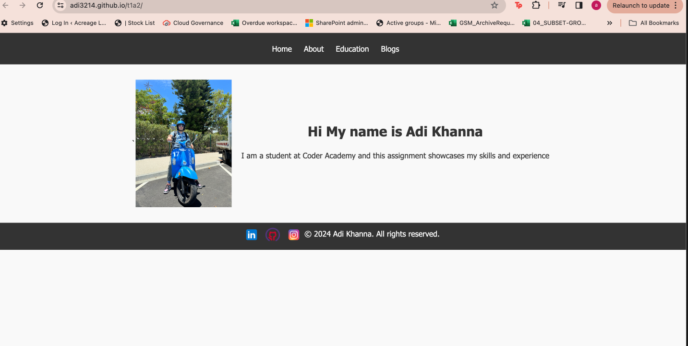
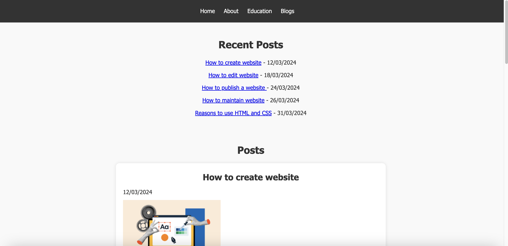
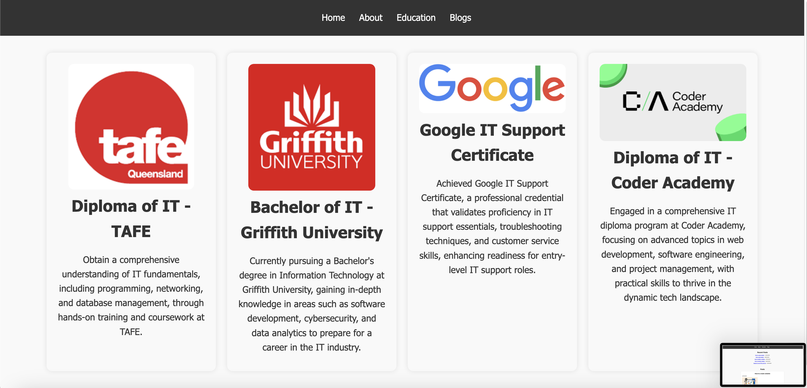
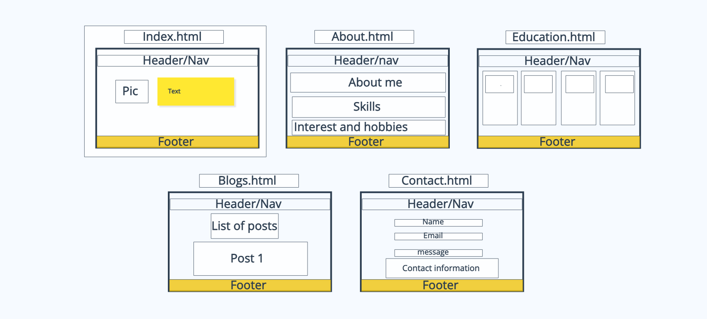

# Portfolio Website README

## Links
- [Portfolio Website] https://adi3214.github.io/t1a2/
- [GitHub Repository] https://github.com/Adi3214/t1a2

## Description
Welcome to my portfolio website! This project serves as a showcase of my skills, projects, and experiences in the field of Web Dev . Below, you'll find more information about the purpose, functionality, features, and technology stack of my portfolio website.
### Purpose
Your portfolio website serves as a showcase of your skills, projects, and experiences to potential employers, clients, or collaborators.

### Functionality / Features
- Responsive design for seamless viewing across devices
- About section highlighting your background, skills, and interests
- Portfolio section showcasing your projects with descriptions and links
- Contact section allowing visitors to reach out to you
- Additional pages for blog posts, resume download, etc. 

### Screenshots

### Sitemap and Wireframe
- Home
- About
- Education
- Blog 
- Contact

### Target Audience
- Potential employers
- Clients
- Collaborators
- Anyone interested in your work and skills

### Tech Stack
- HTML
- CSS
- Deployment Platform: GitHub Pages

